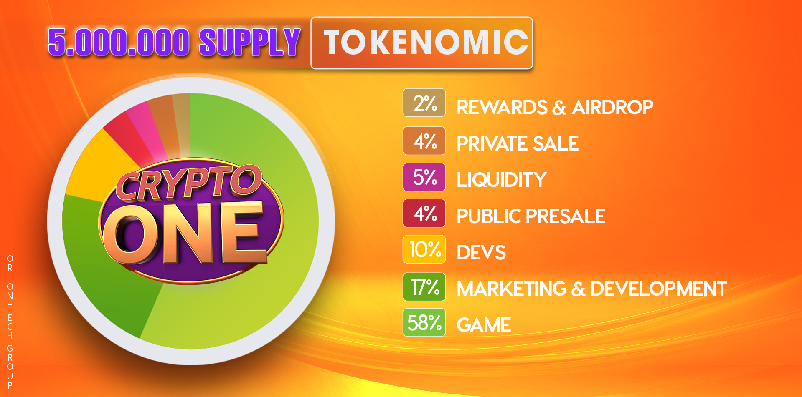

# ℹ Token Information

| Distribution              | Tokens   | Block                                                            |
| ------------------------- | -------- | ---------------------------------------------------------------- |
| Airdrop                   | 100,000  | -                                                                |
| Private Presale           | 200,000  | TGE 40%, then 10% weekly.                                        |
| Developers                | 500,000  | Blocked for 8 months.                                            |
| Liquidity                 | 250,000  | Locked for 12 months.                                            |
| public presale            | 200,000  | -                                                                |
| Marketing and development | 850,000  | -                                                                |
| Game                      | 2.900.00 | Locked for 12 months.                                            |
| Vesting                   |          | <ul><li>20% Unlocked</li><li>80% unblocked 10% p/month</li></ul> |

**Please note:** A transaction fee of 3% will be charged and destined to the project's liquidity pool.
